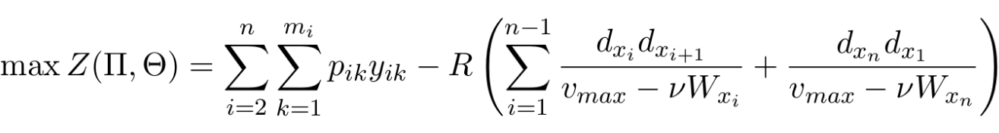

# Compile and Execute:
```bash
$ g++ main.cpp -O3 -o executable
$ ./executable
```

# Multiple Traveling Thieves Problem (MTTP):

The MTTP problem is a variation with multiple agents of the Travelling Thief Problem (TTP), which is a combination of Knapsack Problem with Traveling Salesman Problem (NP-Hard). A GRASP and a Iterated Local Search meta-heuristics are implemented here obtain near-optimal solutions for MTTP in reasonable time.

## Short Description:

A set of N cities area disposed in a state, with distance d[i][j] between any two cities. Each item k positioned in a city i has a value p[i][k] and weight w[i][k]. The global knapsack capacity (you can see it as a truck) limits the amount of items and a tax "R" is paid for it at each time unit. The velocity of a thief depends on its carried items.

## Objective Function:

<p align="center">
  
</p>

## Conclusion:
Considering the instances set, better results were found when compared to the literature ones.

## Team:

* Gabriel Felix 
* Natan Garcias 

# References:
[1] https://cs.adelaide.edu.au/~optlog/research/ttp/2016gecco-mttp.pdf


